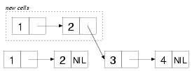

我们希望在此给出常见数据结构的清晰参考。要真正学习该语言，您应该花时间阅读其他资源。以下资源拥有更多细节：

- [Practical CL](http://gigamonkeys.com/book/they-called-it-lisp-for-a-reason-list-processing.html) 作者：Peter Seibel
- [CL Recipes](http://weitz.de/cl-recipes/) 作者： E. Weitz, 充满了解释和提示
- [CL 标准](http://cberr.us/tech_writings/notes/common_lisp_standard_draft.html) 有很好的目录，函数参考，广泛的描述，更多的示例和警告（关于一切），[PDF版](https://gitlab.com/vancan1ty/clstandard_build/-/blob/master/cl-ansi-standard-draft-w-sidebar.pdf)
- [Common Lisp quick reference](http://clqr.boundp.org/)

不要错过附录，当您需要更多的数据结构时，请查看 [awesome-cl](https://github.com/CodyReichert/awesome-cl#data-structures) 列表和 [Quickdocs](https://quickdocs.org/-/search?q=data%20structure)。 

## 列表（Lists）

### 构建列表

*列表也是一个序列，所以我们可以使用下面所示的函数。*

列表的基本元素是 cons 单元格。 我们通过组装 cons 单元格来构建列表。cons 单元格中有两个元素，第一个叫做 car，第二个叫做 cdr

~~~lisp
(cons 1 2)
;; => (1 . 2) ;; 用一个句点和一对值来表示，称为“点对”
(car (cons 1 2))
;; => 1
(cdr (cons 1 2))
;; => 2
~~~

它看起来像这样：

```
[o|o]--- 2
 |
 1
```

当第一个 cons 单元格的第二个元素（`cdr`）指向的是另外一个 cons 单元格，同时，如果最后一个cons单元格的第二个元素(cdr)是 `nil` 的话，我们就就构造了一个列表。

~~~lisp
(cons 1 (cons 2 nil))
;; => (1 2)
(car (cons 1 (cons 2 nil)))
;; => 1
(cdr (cons 1 (cons 2 nil)))
;; => (2)
~~~

它看起来像这样：

```
[o|o]---[o|/]
 |       |
 1       2
```

有注意到列表的输出中间没有一个点吗？Lisp 的解释器能够区别这个规则。

当然，也可以通过 `list` 直接构建一个列表

~~~lisp
(list 1 2)
;; => (1 2)
~~~

或者是通过单引号

~~~lisp
'(1 2)
;; => (1 2)
~~~

它实际上是函数调用 `(quote (1 2))` 的简写

### 循环列表

cons 结构中的 car 和 cdr 可以指向其他的结构，包括其 cons 本身或是同一个列表中的其他元素。因此，就可以定义像循环列表这样的自引用结构。

在构建循环列表之前，需要将 **[print-circle](http://clhs.lisp.se/Body/v_pr_cir.htm)** 这个变量的值设为 `T`，这样解释器就能够识别循环列表了。

~~~lisp
(setf *print-circle* t)
~~~

下面的函数修改列表，将列表的最后一个`cdr`指向自身列表的开头：

~~~lisp
(defun circular! (items)
  "Modifies the last cdr of list ITEMS, returning a circular list"
  (setf (cdr (last items)) items))

(circular! (list 1 2 3))
;; => #1=(1 2 3 . #1#)

(fifth (circular! (list 1 2 3)))
;; => 2
~~~

[list-length](http://www.lispworks.com/documentation/HyperSpec/Body/f_list_l.htm#list-length)函数能够识别出循环列表，然后返回 `nil`。

在解释器中也可以使用 `[#n=](http://www.lispworks.com/documentation/HyperSpec/Body/02_dho.htm)` 表示法直接构建循环列表。可以使用`#n=`作为一个对象的前缀，其中 `n` 是一个无符号十进制整数（一到多位数），标签`#n#`可以用来引用表达式中后面的对象。

~~~lisp
'#42=(1 2 3 . #42#)
;; => #1=(1 2 3 . #1#)
~~~

注意，提交给读取器(reader)的标签 `n=42` 被读取器丢弃了，打印器(printer)重新定义了一个新的标签（`n=1`)。

进一步阅读

- [Let over Lambda](https://letoverlambda.com/index.cl/guest/chap4.html#sec_5)的循环表达式部分

### `car/cdr` 或者 `first/rest` 以及 `second` 到 `tenth`

~~~lisp
(car (cons 1 2)) ;; => 1
(cdr (cons 1 2)) ;; => 2
(first (cons 1 2)) ;; => 1
(first '(1 2 3)) ;; => 1
(rest '(1 2 3)) ;; => (2 3)
~~~

我们可以通过 `setf` 来赋予任何新的值。

### `last`、`butlast`、`nbutlast`(n为可选参数）

返回列表中的最后一个（或是倒数第 n 个） cons 结构。

~~~lisp
(last '(1 2 3))
;; => (3)
(car (last '(1 2 3)) ) ;; or (first (last …))
;; => 3
(butlast '(1 2 3))
;; => (1 2)
~~~

在 [Alexandria](https://common-lisp.net/project/alexandria/draft/alexandria.html#Conses) 包中， `lastcar` 等价于 `(first (last ...))`。 

~~~lisp
(alexandria:lastcar '(1 2 3))
;; => 3
~~~

### 倒序（`reverse`、`nreverse`）

`reverse` 和 `nreverse` 会返回一个序列的倒序。

其中 `nreverse` 会破坏原有序列的结构，N 代表 **non-consing** ，这意味着该函数不需要分配任何新的 cons 单元格。它可能(实际上是确实)重用和修改原始的序列：

~~~lisp
(defparameter mylist '(1 2 3))
;; => (1 2 3)
(reverse mylist)
;; => (3 2 1)
mylist
;; => (1 2 3)
(nreverse mylist)
;; => (3 2 1)
mylist
;; => (1)
~~~

### 追加（`append`）

`append` 可以接受任意多个列表参数，然后返回一个包含所有参数元素的新列表。

~~~lisp
(append (list 1 2) (list 3 4))
;; => (1 2 3 4)
~~~

新列表与 `(3 4)` 共享一些 cons 单元格：



`nconc` is the recycling equivalent.

### 栈操作（`push` `pop`）

`push` 将元素添加到列表中，将结果列表保存到某个位置，然后返回该列表。

~~~lisp
defparameter mylist '(1 2 3))
(push 0 mylist)
;; => (0 1 2 3)
~~~

~~~lisp
(defparameter x '(a (b c) d))
;; => (A (B C) D)
(push 5 (cadr x))
;; => (5 B C)
x
;; => (A (5 B C) D)
~~~

`push` 等价于 `(setf place (cons item place))` ，区别在于，子表达式 `place` 只会被求值一次，并且 `item` 在 `palce` 之前被求值。

没有内置的函数可以将元素添加到列表的末尾。 这是一项成本很高的操作（必须遍历整个列表）。 因此，如果您需要这样做：要么考虑使用其他数据结构，要么在需要时反转您的列表。

与 `push` 相反，`pop`返回列表的第一个元素，同时从列表中删除该元素。

### 索引（`nthcdr`）

当 `first`、`second` ... `tenth` 不够用时，可以使用 `nthcdr`

~~~lisp
(defparameter mylist '(1 2 3 4 5 6 7 8 9 10 11))
(nthcdr 10 mylist)
~~~

### car/cdr 嵌套（`cadr`，`caadr`……）

~~~lisp
(caar (list 1 2 3))                  ==> error
(caar (list (list 1 2) 3))           ==> 1
(cadr (list (list 1 2) (list 3 4)))  ==> (3 4)
(caadr (list (list 1 2) (list 3 4))) ==> 3
~~~

### destructuring-bind

`destructuring-bind` 可以将参数绑定到列表元素。我们可以解构树、plist，甚至提供默认值。 

简单的匹配： 

~~~lisp
(destructuring-bind (x y z) (list 1 2 3)
  (list :x x :y y :z z))
;; => (:X 1 :Y 2 :Z 3)
~~~

同时也可以匹配到子列表

~~~lisp
(destructuring-bind (x (y1 y2) z) (list 1 (list 2 20) 3)
  (list :x x :y1 y1 :y2 y2 :z z))
;; => (:X 1 :Y1 2 :Y2 20 :Z 3)
~~~

参数列表中也可以使用通常的 `&optional`、`&rest`和`&key`参数

~~~lisp
(destructuring-bind (x (y1 &optional y2) z) (list 1 (list 2) 3)
  (list :x x :y1 y1 :y2 y2 :z z))
;; => (:X 1 :Y1 2 Y2: NIL :Z 3)
~~~

~~~lisp
(destructuring-bind (&key x y z) (list :z 1 :y 2 :x 3)
  (list :x x :y y :z z))
;; => (:X 3 :Y 2 :Z 1)
~~~

`&whole` 参数绑定到整个列表。 它必须是第一个，其他参数跟在后面。 

~~~lisp
(destructuring-bind (&whole whole-list &key x y z) (list :z 1 :y 2 :x 3)
  (list :x x :y y :z z :whole whole-list))
;; => (:X 3 :Y 2 :Z 1 :WHOLE-LIST (:Z 1 :Y 2 :X 3))
~~~

解构 plist，给出默认值：
（示例来自《Common Lisp Recipes》，作者 E. Weitz，Apress，2016） 

~~~lisp
(destructuring-bind (&key a (b :not-found) c
                     &allow-other-keys)
  '(:c 23 :d "D" :a #\A :foo :whatever)
  (list a b c))
;; => (#\A :NOT-FOUND 23)
~~~

如果需要进行模式匹配的话，见 [模式匹配](08.pattern-matching.md) 章节

### 断言（`null`，`listp`）

`null` 等价于 `not`，但被认为是更好的风格。
`listp` 判断对象是否是 cons 或 `nil`

还有一些其他的序列的断言: `ldiff` `tailp` `list*` `make-list` `fill` `revappend` `nreconc` `consp` `atom`

~~~lisp
(make-list 3 :initial-element "ta")
;; => ("ta" "ta" "ta")

(make-list 3)
;; => (NIL NIL NIL)

(fill * "hello")
;; => ("hello" "hello" "hello")
~~~

### member (elt, list)

返回列表的尾部，从满足 `eql` 的第一个元素开始。

接受 `:test`, `test-not`, `:key`参数（可以是函数或符号）

~~~lisp
(member 2 '(1 2 3))
;; (2 3)
~~~

### 替换

[`subst`](http://www.lispworks.com/documentation/HyperSpec/Body/f_substc.htm) 和 `subst-if` 在树中搜索和替换指定的元素或子表达式（或者当它满足可选的`test`时）：

~~~lisp
(subst 'one 1 '(1 2 3))
;; => (ONE 2 3)
(subst 'one 1 '(1 2 1))
;; => (ONE 2 ONE)
(subst '(1 . one) '(1 . 1) '((1 . 1) (2 . 2) (3 . 3)) :test #'equal)
;; ((1 . ONE) (2 . 2) (3. 3))
~~~

[`sublis`](http://www.lispworks.com/documentation/HyperSpec/Body/f_sublis.htm)允许一次替换多个对象。它用`alist`列表中给定的新值替换`alist`列表中给定并在`tree`中找到的对象：

~~~lisp
(sublis '((x . 10) (y . 20))
        '(* x (+ x y) (* y y)))
;; (* 10 (+ 10 20) (* 20 20))
~~~

`sublis` 接受 `:test` 和 `:key` 参数。 `:test` 是一个函数，它接受两个参数，key 和 subtree。

~~~lisp
(sublis '((t . "foo"))
        '("one" 2 ("three" (4 5)))
		:key #'stringp)
;; ("foo" 2 ("foo" (4 5)))
~~~

## 序列（Sequences）

**列表（list）**和**向量（vectors）**（连同**字符窜（string）**）都是序列。

注：另请参阅[字符串](03.strings.md)

大部分序列的函数都可以使用关键字参数，且都是可选的，放置顺序也比较随意。

要特别注意 `:test` 参数，该参数默认是 `eql`（字符串的话是 `:equal`）

`:key` 参数应该传递 `nil` 或只有一个参数的函数。 此函数用作过滤器，通过该过滤器可以看到序列的元素。 例如：

~~~lisp
(find x y :key 'car)
~~~

和 `(assoc* x y)` 相似，在列表中搜索元素，检查列表中元素的 `car` 是否于 `x` 相等, 而不是列表中的与`x`相等的元素本身。如果省略 `:key` 参数，或者为 `nil` 时，过滤器实际上是恒等函数。

带有 alist 的示例（请参见下面的定义）：

~~~lisp
(defparameter my-alist (list (cons 'foo "foo")
                             (cons 'bar "bar")))
;; => ((FOO . "foo") (BAR . "bar"))
(find 'bar my-alist)
;; => NIL
(find 'bar my-alist :key 'car)
;; => (BAR . "bar")
~~~

使用带有一个参数的 `lambda`

~~~lisp
(find 'bar my-alist :key (lambda (it) (car it)))
~~~

注：[cl21](https://lispcookbook.github.io/cl-cookbook/cl21.html#shorter-lambda)标准中，可将 `lambda` 简写：

~~~lisp
(find 'bar my-alist :key ^(car %))
(find 'bar my-alist :key (lm (it) (cat it)))
~~~

### 断言：`every`，`some`……

对序列的任何一组对应元素逐一测试，如果有返回`nil`的话，`every, notevery (test, sequence)` 分别返回`nil`和`t`。

~~~lisp
(defparameter foo '(1 2 3))
(every #'evenp foo)
;; => NIL
(some #'evenp foo)
;; => T

(defparameter str '("foo" "bar" "team"))
(every #'stringp str)
;; => T
(some #'(lambda (it) (= 3 (length it))) str)
;; => T
(some ^(= 3 (length %)) str) ;; in CL21
;; => T
~~~
`some`、`notany`(test, sequence)：如果测试结果中又一个为 t，返回 t，否则为 nil。

`mismatch`(sequence-a, sequence-b)：返回 sequence-a 在 sequence-b 中第一次匹配后的位置。如果sequence-a 和 sequence-b 完全匹配的话，返回 NIL。可以使用参数：`:from-end bool`、`start1`、`start2` 以及 `:end[1, 2]`

### 函数合集

在 [Alexandria](https://common-lisp.net/project/alexandria/draft/alexandria.html#Sequences)包中定义了很多序列相关的函数：`starts-with`，`ends-with`，`ends-with-subseq`，`length=`，`emptyp`……

#### length(sequence)

#### elt(sequence, index)

注意，这里第一个参数是序列

#### count(foo, sequence)

返回 sequences 中匹配了 foo 的个数。额外参数：`:from-end`，`:start`，`:end`

#### subseq(sequence start, [end])

```lisp
(subseq (list 1 2 3) 0)
;; (1 2 3)
(subseq (list 1 2 3) 1 2)
;; (2)
```

但是，要注意 end 是否大于列表长度：

```lisp
(subseq (list 1 2 3) 0 99)
;; => Error: the bounding indices 0 and 99 are bad for a sequence of length 3.
```

对于有可能大于列表长度的 end, 请使用 `alexandria-2:subseq*`：

```lisp
(alexandria-2:subseq* (list 1 2 3) 0 99) 
;; (1 2 3)
```

`subseq`可以使用`setf`，但是仅当新序列与要替换的序列具有相同的长度时才行。

####  sort, stable-sort(sequence, test [, key function])

这些排序函数是破坏性的，所以人们可能更喜欢在排序之前用 `copy-seq`拷贝序列。

~~~lisp
  (sort (copy-seq seq) :test #'string<)
~~~

和`sort`不同，`stable-sort`承诺保持参数的顺序。 理论上，这样做的结果：

```lisp
(sort '((1 :a) (1 :b)) #'< :key #'first)
```

要么是`((1 :A) (1 :B))`, 要么是`((1 :B) (1 :A))`。在我的测试中，顺序没有改变，但是语言标准并没有保证这样。

#### find, position(foo, sequence)

~~~lisp
  (find 20 '(10 20 30))
  ;; 20
  (position 20 '(10 20 30))
~~~

#### find-if, find-if-not, position-if, position-if-not(test sequence)

#### search(sequence-a, sequence-b)

返回 sequence-a 在 sequence-b 中的位置，若不匹配，则为 NIL。支持 `from-end`，`end1/2`等参数。
#### substitude, nsubstitute[if, if-not]

~~~lisp
(substitute #\o #\x "hellx") ;; => "hello"
(substitute :a :x '(:a :x :x)) ;; => (:A :A :A)
(substitude "a" "x"  '("a" "x" "x") :test #'string=) ;; => ("a" "a" "a")
~~~

#### sort, stable-sort, merge

#### replace(sequence-a, sequence-b)

#### remove, delete(foo sequence)

`delete` 是 `remove` 的回收版。支持 `:start/end`，`:key`，`:count`。

~~~lisp
  (remove "foo" '("foo" "bar" "foo") :test 'equal)
  ;; => ("bar")
~~~

#### mapping(`map` `mapcar` `remove-if[-not]`……)

~~~lisp
  (defparameter foo '(1 2 3))
  (map 'list (lambda (it) (* 10 it)) foo)
~~~

#### reduce(function, sequence)

特殊参数 `:initial-value`

~~~lisp
  (reduce '- '(1 2 3 4))
  ;; => -8
  (reduce '- '(1 2 3 4) :initial-value 100)
  ;; => 90
~~~

### 使用变量创建列表

这是 `反引用(backquote)` 的用法之一

~~~lisp
  (defparameter *var* "bar")
  ;; First try:
  '("foo" *var* "baz") ;; no backquote
  ;; => ("foo" *VAR* "baz") ;; nope

  `("foo" ,*var* "baz") ;; backquote, comma
  ;; => ("foo" "bar" "baz") ;; good
~~~

反引号标志着只是插入的，逗号表示使用变量的值。
如果变量是一个列表的话：

~~~lisp
  (defparameter *var* '("bar" "baz"))
  ;; First try:
  `("foo" ,*var*)
  ;; => ("foo" ("bar" "baz")) ;; nested list
  `("foo" ,@*var*) ;; backquote, comma-@ to
  ;; => ("foo" "bar" "baz")
~~~

## 集合（Set）

### 交集：`intersection`

~~~lisp
(defparameter list-a '(0 1 2 3))
(defparameter list-b '(0 2 4))
(intersection list-a list-b)
;; => (2 0)
~~~

### 差集：`set-difference`

~~~lisp
(set-difference list-a list-b)
;; => (3 1)
(set-difference list-b list-a)
;; => (4)
~~~

### 并集：`union`

~~~lisp
(union list-a list-b)
;; => (3 1 0 2 4) ;; order can be different in your lisp
~~~

### 补集：`set-exclusive-or`

~~~lisp
(set-exclusive-or list-a list-b)
;; => (4 3 1)
~~~

## 数组和向量（Array、vectors）

### 数组

数组的特性是：访问时间为常数(θ(1))
简单的数组既不可替换（`:displaced-to`，指向以另一个数组），也不可变(`:adjust-array`)，同时也没有填充指针(`fill-pointer`, 随着元素的增减而进行相应的改变)。
**向量** 是一维的数组。

- `make-array`(sizes-list :adjustable bool)
- `adjust-array`(array, sizes-list, :element-type, :initial-element)
- `aref`(array i [j ...])
  `aref`(array i j k ...) 或 `row-major-aref`(array i) 等价于 `(aref i i i ...)`
  ~~~lisp
  (defparameter myarray (make-array '(2 2 2) :initial-element 1))
  myarray
  ;; => #3A(((1 1) (1 1)) ((1 1) (1 1)))
  (aref myarray 0 0 0 )
  ;; => 1
  (setf (aref myarray 0 0 0) 9)
  ;; => 9
  (row-major-aref myarray 0)
  ;; => 9
  ~~~
- `array-demensions`(array)： 数组的维度列表，即数组中元素的总个数
- `array-demension`(array)：每维数组的大小
  ~~~lisp
  (defparameter myarray (make array '(2 2 2)))
  ;; => MYARRAY
  myarray
  ;; => #3A(((0 0) (0 0)) ((0 0) (0 0)))
  (array-rank myarray)
  ;; => 3
  (array-dimensions myarray)
  ;; => (2 2 2)
  (array-dimension myarray 0)
  ;; => 2
  (array-total-size myarray)
  ;; => 8
  ~~~

### 向量

  ~~~lisp
  (vector 1 2 3)
  ;; => #(1 2 3)
  #(1 2 3)
  ;; => #(1 2 3)
  ~~~

  - `vector-push`(foo vector)
  - `vector-push-extend`(foo vector [extension-num])
  - `vector-pop`(vector)
  - `fill-pointer`(vector)
  - `coerce`(vector 'list)：将向量转换成列表


## 哈希表（Hash Table）

### 创建哈希表 `make-hash-table`

~~~lisp
(defvar *my-hash* (make-hash-table))
(setf (gethash :name *my-hash*) "Eitaro Fukamachi")
~~~

### 获取哈希值

~~~lisp
(gethash :name *my-hash*)
~~~

### 当键值对不存在时

~~~lisp
(gethash 'bar *my-hash* "default-bar")
;; => "default-bar"
;; NIL
~~~

### 获取哈希表中的键值对

~~~lisp
(ql:quickload :alexandria)
;; [ ... ]
(alexandria:hash-table-keys *my-hash*)
;; => (:NAME)
~~~

### 添加元素

~~~lisp
CL-USER> (defparameter *my-hash* (make-hash-table))
*MY-HASH*
CL-USER> (setf (gethash 'one-entry *my-hash*) "one")
"one"
CL-USER> (setf (gethash 'another-entry *my-hash*) 2/4)
1/2
CL-USER> (gethash 'one-entry *my-hash*)
"one"
T
CL-USER> (gethash 'another-entry *my-hash*)
1/2
T
~~~

~~~lisp
CL-USER> (defparameter *my-hash* (make-hash-table))
*MY-HASH*
CL-USER> (setf (gethash 'one-entry *my-hash*) "one")
"one"
CL-USER> (if (gethash 'one-entry *my-hash*)
           "Key exists"
           "Key does not exist")
"Key exists"
CL-USER> (if (gethash 'another-entry *my-hash*)
           "Key exists"
           "Key does not exist")
"Key does not exist"
~~~

~~~lisp
CL-USER> (setf (gethash 'another-entry *my-hash*) nil)
NIL
CL-USER> (if (gethash 'another-entry *my-hash*)
           "Key exists"
           "Key does not exist")
"Key does not exist"
~~~

~~~lisp
CL-USER> (if (nth-value 1 (gethash 'another-entry *my-hash*))
           "Key exists"
           "Key does not exist")
"Key exists"
CL-USER> (if (nth-value 1 (gethash 'no-entry *my-hash*))
           "Key exists"
           "Key does not exist")
"Key does not exist"
~~~

### 删除元素

~~~lisp
CL-USER> (defparameter *my-hash* (make-hash-table))
*MY-HASH*
CL-USER> (setf (gethash 'first-key *my-hash*) 'one)
ONE
CL-USER> (gethash 'first-key *my-hash*)
ONE
T
CL-USER> (remhash 'first-key *my-hash*)
T
CL-USER> (gethash 'first-key *my-hash*)
NIL
NIL
CL-USER> (gethash 'no-entry *my-hash*)
NIL
NIL
CL-USER> (remhash 'no-entry *my-hash*)
NIL
CL-USER> (gethash 'no-entry *my-hash*)
NIL
NIL
~~~

### 遍历哈希表

~~~lisp
CL-USER> (defparameter *my-hash* (make-hash-table))
*MY-HASH*
CL-USER> (setf (gethash 'first-key *my-hash*) 'one)
ONE
CL-USER> (setf (gethash 'second-key *my-hash*) 'two)
TWO
CL-USER> (setf (gethash 'third-key *my-hash*) nil)
NIL
CL-USER> (setf (gethash nil *my-hash*) 'nil-value)
NIL-VALUE
CL-USER> (defun print-hash-entry (key value)
    (format t "The value associated with the key ~S is ~S~%" key value))
PRINT-HASH-ENTRY
CL-USER> (maphash #'print-hash-entry *my-hash*)
The value associated with the key FIRST-KEY is ONE
The value associated with the key SECOND-KEY is TWO
The value associated with the key THIRD-KEY is NIL
The value associated with the key NIL is NIL-VALUE
~~~

~~~lisp
;;; same hash-table as above
CL-USER> (with-hash-table-iterator (my-iterator *my-hash*)
           (loop
              (multiple-value-bind (entry-p key value)
                  (my-iterator)
                (if entry-p
                    (print-hash-entry key value)
                    (return)))))
The value associated with the key FIRST-KEY is ONE
The value associated with the key SECOND-KEY is TWO
The value associated with the key THIRD-KEY is NIL
The value associated with the key NIL is NIL-VALUE
NIL
~~~

~~~lisp
;;; same hash-table as above
CL-USER> (loop for key being the hash-keys of *my-hash*
           do (print key))
FIRST-KEY
SECOND-KEY
THIRD-KEY
NIL
NIL
CL-USER> (loop for key being the hash-keys of *my-hash*
           using (hash-value value)
           do (format t "The value associated with the key ~S is ~S~%" key value) )
The value associated with the key FIRST-KEY is ONE
The value associated with the key SECOND-KEY is TWO
The value associated with the key THIRD-KEY is NIL
The value associated with the key NIL is NIL-VALUE
NIL
CL-USER> (loop for value being the hash-values of *my-hash*
           do (print value))
ONE
TWO
NIL
NIL-VALUE
NIL
CL-USER> (loop for value being the hash-values of *my-hash*
           using (hash-key key)
           do (format t "~&~A -> ~A" key value))
FIRST-KEY -> ONE
SECOND-KEY -> TWO
THIRD-KEY -> NIL
NIL -> NIL-VALUE
NIL
~~~

### 获取哈希表键值对的数量：`hash-table-count`

~~~lisp
CL-USER> (defparameter *my-hash* (make-hash-table))
*MY-HASH*
CL-USER> (hash-table-count *my-hash*)
0
CL-USER> (setf (gethash 'first *my-hash*) 1)
1
CL-USER> (setf (gethash 'second *my-hash*) 2)
2
CL-USER> (setf (gethash 'third *my-hash*) 3)
3
CL-USER> (hash-table-count *my-hash*)
3
CL-USER> (setf (gethash 'second *my-hash*) 'two)
TWO
CL-USER> (hash-table-count *my-hash*)
3
CL-USER> (clrhash *my-hash*)
#<EQL hash table, 0 entries {48205F35}>
CL-USER> (hash-table-count *my-hash*)
0
~~~

### 性能

~~~lisp
CL-USER> (defparameter *my-hash* (make-hash-table))
*MY-HASH*
CL-USER> (hash-table-size *my-hash*)
65
CL-USER> (hash-table-rehash-size *my-hash*)
1.5
CL-USER> (time (dotimes (n 100000) (setf (gethash n *my-hash*) n)))
Compiling LAMBDA NIL:
Compiling Top-Level Form:

Evaluation took:
  0.27 seconds of real time
  0.25 seconds of user run time
  0.02 seconds of system run time
  0 page faults and
  8754768 bytes consed.
NIL
CL-USER> (time (dotimes (n 100000) (setf (gethash n *my-hash*) n)))
Compiling LAMBDA NIL:
Compiling Top-Level Form:

Evaluation took:
  0.05 seconds of real time
  0.05 seconds of user run time
  0.0 seconds of system run time
  0 page faults and
  0 bytes consed.
NIL
~~~

~~~lisp
CL-USER> (log (/ 100000 65) 1.5)
18.099062
CL-USER> (let ((size 65)) (dotimes (n 20) (print (list n size)) (setq size (* 1.5 size))))
(0 65)
(1 97.5)
(2 146.25)
(3 219.375)
(4 329.0625)
(5 493.59375)
(6 740.3906)
(7 1110.5859)
(8 1665.8789)
(9 2498.8184)
(10 3748.2275)
(11 5622.3413)
(12 8433.512)
(13 12650.268)
(14 18975.402)
(15 28463.104)
(16 42694.656)
(17 64041.984)
(18 96062.98)
(19 144094.47)
NIL
~~~

~~~lisp
CL-USER> (defparameter *my-hash* (make-hash-table :size 100000))
*MY-HASH*
CL-USER> (hash-table-size *my-hash*)
100000
CL-USER> (time (dotimes (n 100000) (setf (gethash n *my-hash*) n)))
Compiling LAMBDA NIL:
Compiling Top-Level Form:

Evaluation took:
  0.04 seconds of real time
  0.04 seconds of user run time
  0.0 seconds of system run time
  0 page faults and
  0 bytes consed.
NIL
~~~

~~~lisp
CL-USER> (defparameter *my-hash* (make-hash-table :rehash-size 100000))
*MY-HASH*
CL-USER> (hash-table-size *my-hash*)
65
CL-USER> (hash-table-rehash-size *my-hash*)
100000
CL-USER> (time (dotimes (n 100000) (setf (gethash n *my-hash*) n)))
Compiling LAMBDA NIL:
Compiling Top-Level Form:

Evaluation took:
  0.07 seconds of real time
  0.05 seconds of user run time
  0.01 seconds of system run time
  0 page faults and
  2001360 bytes consed.
NIL
~~~

## Alist

**Alist**: An association list is a list of cons cells.
~~~lisp
(defparameter *my-alist* (list (cons 'foo "foo")
                             (cons 'bar "bar")))
;; => ((FOO . "foo") (BAR . "bar"))
~~~
其结构如下：
```
[o|o]---[o|/]
 |       |
 |      [o|o]---"bar"
 |       |
 |      BAR
 |
[o|o]---"foo"
 |
FOO
```
所以，通过其结构来对其进行定义：
~~~lisp
(setf *my-alist* '((:foo . "foo")
                   (:bar . "bar")))
~~~

## Plist

**Plist**: A property list is simply a list that alternates a key, a value, and so on, where its keys are symbols (we can not set its :test). More precisely, it first has a cons cell whose `car` is the key, whose `cdr` points to the following cons cell whose `car` is the value.
~~~lisp
(defparameter my-plist (list 'foo "foo" 'bar "bar"))
~~~

```
[o|o]---[o|o]---[o|o]---[o|/]
 |       |       |       |
FOO     "foo"   BAR     "bar"
```

~~~lisp
(defparameter my-plist (list 'foo "foo" 'bar "bar"))
;; => (FOO "foo" BAR "bar")
(setf (getf my-plist 'foo) "foo!!!")
;; => "foo!!!"
~~~

## 结构体（Structres）

### 创建：`defstruct`

~~~lisp
(defstruct person
  id name age)
~~~

### 设置默认值

~~~lisp
(defstruct person
  id
  (name "john doe")
	age)
~~~

### 设置默认类型

~~~lisp
(defstruct person
  id
  (name "john doe" :type string)
  age)
~~~

~~~lisp
(defparameter *me* (make-person))
*me*
#S(PERSON :ID NIL :NAME "john doe" :AGE NIL)
~~~

当类型设置错误时：

~~~lisp
(defparameter *bad-name* (make-person :name 123))
~~~

```
Invalid initialization argument:
  :NAME
in call for class #<STRUCTURE-CLASS PERSON>.
   [Condition of type SB-PCL::INITARG-ERROR]
```

不使用关键次参数来创建结构体

~~~lisp
(defstruct (person (:constructor create-person (id name age)))
  id
  name
  age)
~~~

~~~lisp
(create-person 1 "me" 7)
#S(PERSON :ID 1 :NAME "me" :AGE 7)
~~~

然而，默认的 `make-person` 不可以使用

~~~lisp
(make-person :name "me")
;; debugger:
obsolete structure error for a structure of type PERSON
[Condition of type SB-PCL::OBSOLETE-STRUCTURE]
~~~

### 访问 **槽（slot）**

~~~lisp
(person-name *me*)
;; "john doe"
~~~

~~~lisp
(setf (person-name *me*) "Cookbook author")
(person-name *me*)
;; "Cookbook author"
~~~

### 断言

在创建结构时，一个断言函数会自动创建
~~~lisp
(person-p *me*)
T
~~~

### 单继承

~~~lisp
(defstruct (female (:include person))
  (gender "female" :type string))
(make-female :name "Lilie")
;; #S(FEMALE :ID NIL :NAME "Lilie" :AGE NIL :GENDER "female")
~~~

### 局限

修改后，实例不会被更新

~~~lisp
(defstruct person
  id
  (name "john doe" :type string)
  age
  email)
attempt to redefine the STRUCTURE-OBJECT class PERSON
incompatibly with the current definition
   [Condition of type SIMPLE-ERROR]

Restarts:
 0: [CONTINUE] Use the new definition of PERSON, invalidating already-loaded code and instances.
 1: [RECKLESSLY-CONTINUE] Use the new definition of PERSON as if it were compatible, allowing old accessors to use new instances and allowing new accessors to use old instances.
 2: [CLOBBER-IT] (deprecated synonym for RECKLESSLY-CONTINUE)
 3: [RETRY] Retry SLIME REPL evaluation request.
 4: [*ABORT] Return to SLIME's top level.
 5: [ABORT] abort thread (#<THREAD "repl-thread" RUNNING {1002A0FFA3}>)
~~~

如果重新开始的话，使用新的定义，将无法访问 `*me*`
~~~lisp
*me*
obsolete structure error for a structure of type PERSON
 [Condition of type SB-PCL::OBSOLETE-STRUCTURE]
~~~

## 树

`tree-equal` `copy-tree`
